# FORWARD STOCK PLAN AUTOMATION

Forward Stock Plan Automation is a Python terminal program, which is designed to aid to logistic and supply function of distribution and wholesaling companies in order to manage their stock levels and place timely orders. This business process is an everyday job if a distributor strives to avoid out-of-stock situations. An automation of the process becomes a must-have tool for importers, distributors and wholesalers.

The project can be observed and tested [here](https://forward-stock-plan-73f29ce621b0.herokuapp.com/)

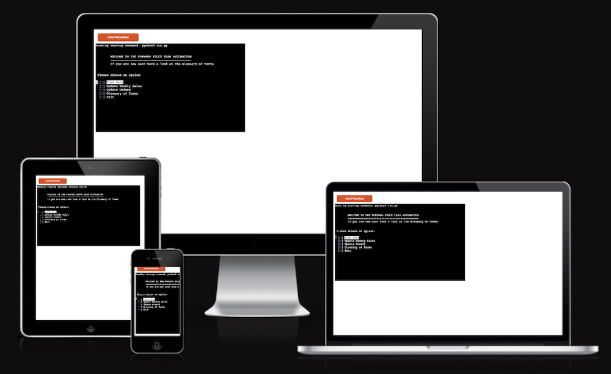

## Business Context
Once there is always a non-zero time between placing an order and a delivery of an item the inbound logistics of any business will face a problem of proper stocks control. Such time when the goods are actually in transit is usually called by distributors "__a lead time__". The problem becomes an essential challenge for a business when marketing cycle of that business is comparable to lead times and sometimes may take more then one week, or several weeks or even more than a month (for example, as regards the imports from China)

I developed this application aiming at automation of this process for mid-size and smaller businesses that cannot afford the expensive software and try to cope with the task by means of Excel or other spreadsheet applications.

A Python-based system can offer significant advantages over a purely Excel-based system in terms of data handling, integration with other systems, customization, scalability and data protection. Python can automate mundane tasks, making them much more efficient. This is particularly useful for tasks such as updating sales forecasts, calculating order recommendations, and controlling stock levels. Automation can reduce the risk of human error, increase efficiency, and free up time for more strategic tasks.

Basically, what the application does can be briefly described as follows:

- updates weekly sales forecasts based on actual sales input and retrospective sales
- calculates forward stock plan (future stocks) at the beginning of every coming week to the end of a year and based on weekly  delivery plan
- calculates orders recommendations: quantities per item and time for placement
- updates delivery plan after any change in orders 
- updates forward stock plan based on new order plan and/or sales forecast

At the current version of the application there are 2 product ranges used as templates: 
- Planters nuts with 6 product items
- Ritter Sport chocolate bars with 4 product items

The application assumes easy settings for adding both new product ranges and new product items within a range.

## Glossary Of Terms
    
    "Product Ranges" - product items under one umbrella brand.
    Currently there are two product ranges: Planters and
    Ritter Sport

    "Week Number" - the number of the week in the year
    
    "Weekly Sales" - the number of units sold in the chosen week
    or with regards to future weeks - sales forecast

    "Weekly Stocks" - the number of units in stock at 
    (important!) the beginning of the week

    "Orders" - the number of units to be ordered in 
    a particular week (recommendation) taking into
    consideration the lead time of particular Product Range

    "Deliveries" - the number of units delivered in 
    the past week or with regards to future weeks - 
    to be delivered at the estimated week of delivery

    "Lead Time" - the number of weeks between placing 
    the order and receiving the delivery. The delivered
    goods become available for sale only from the next week
    after estimated arrival (Lead Time + 1)

    "Forward Stock Plan" - the number of units in stock 
    estimated for all future weeks at the current rate of 
    sales and expected deliveries

    "Safety Margin" - the percentage of additional units to 
    order on top of the average sales to avoid stockouts

    "Minimum Stock Level" - the multiple of average sales
    to keep in stock to avoid stockouts

## Features
The application is run in terminal. Once being launched it displays a welcome message and a main menu.

### Navigating menus

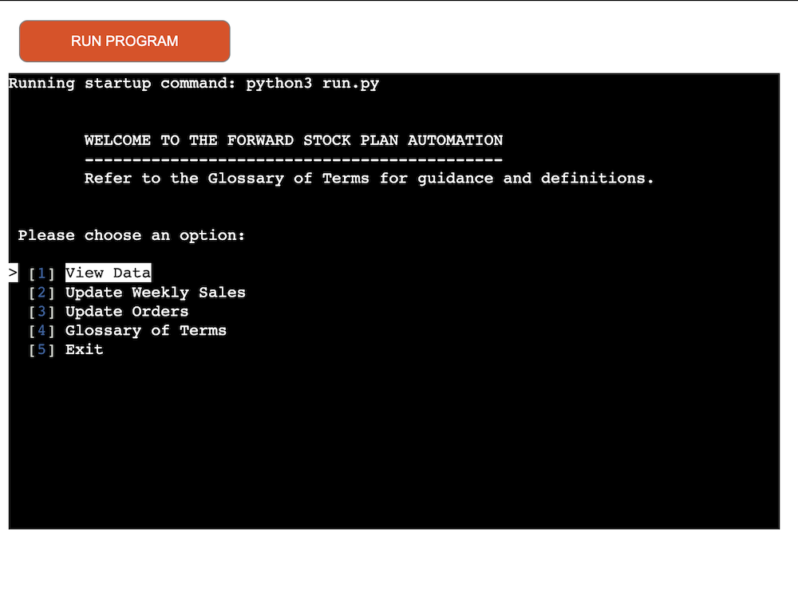

- Main menu
    - _[1] View Data_ - view sales, stocks, orders, deliveries
    for a given product range and week number. Data is 
    presented in a table format for all weeks from the
    chosen week number to the end of year

    - _[2] Update Weekly Sales_ - type in sales for the chosen
    product range and week. The data can be updated 
    for any chosen week to record either actual sales or 
    update forecasts. Once all items for the product range 
    have been typed in, the application calculates and updates 
    sales forecast and stocks.    
    Both Sales and Stocks are then stored in
    their respective worksheets

    - [3] _Update Orders_ - calculate orders recommendation 
    based on new sales, stocks and deliveries data for a 
    given week number and product range. Updates Orders, 
    Deliveries, and Stocks to the respective worksheets

    - [4] _Glossary of Terms_ - basic glossary which provides guidance 
    on using options of the menu and terminology definitions

    - [5] _Exit_ - The correct way to exit the application without hard reset

-  _[1] View Data_, _[2] Update Weekly Sales_, [3] _Update Orders_ sub-menu, which is common for these 3:
    - choose the product range to work with in order to View Data, Update Weekly Sales or Update Orders.

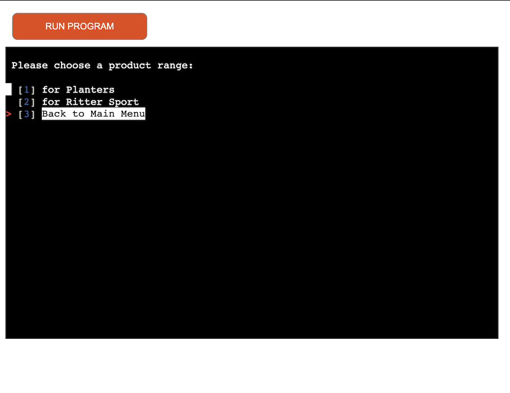

- Main Menu Chart

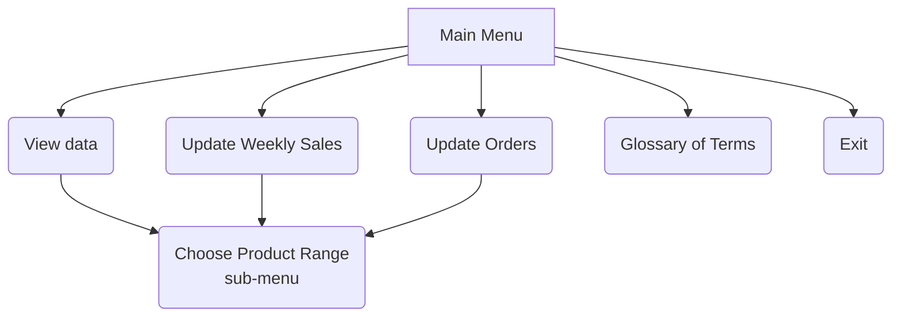
-------------------
- View Data sub-menu

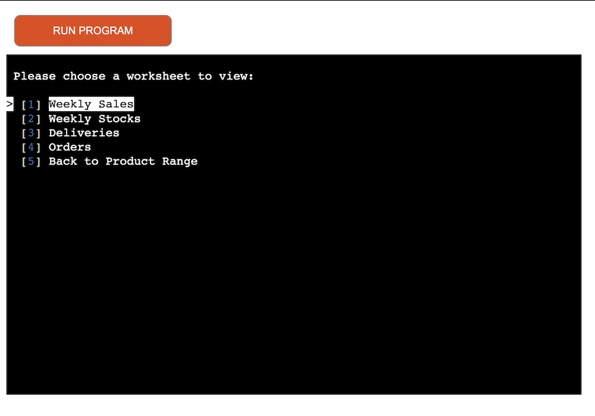
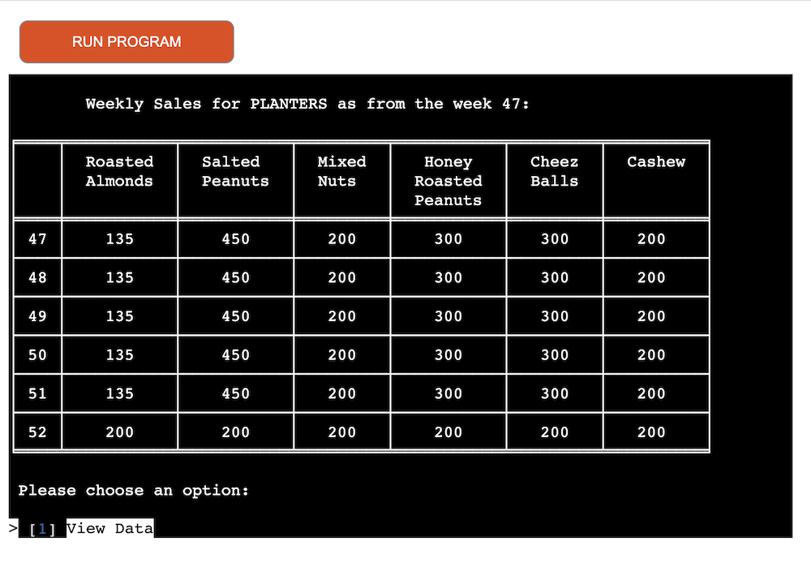
--------------------------------
- Update Weekly Sales sub-menu

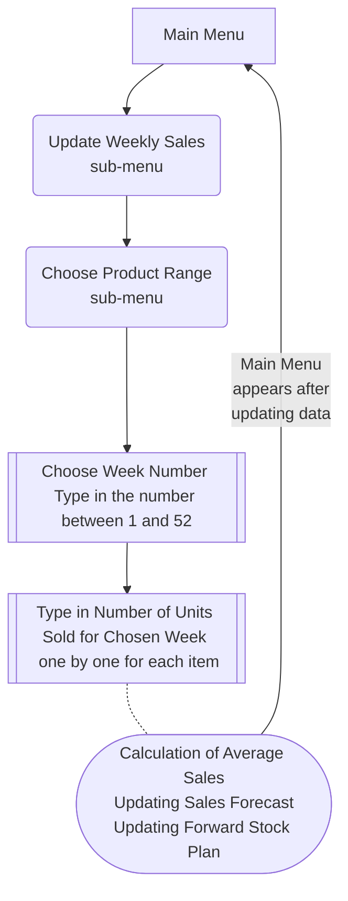
----------------
- Update Orders sub-menu

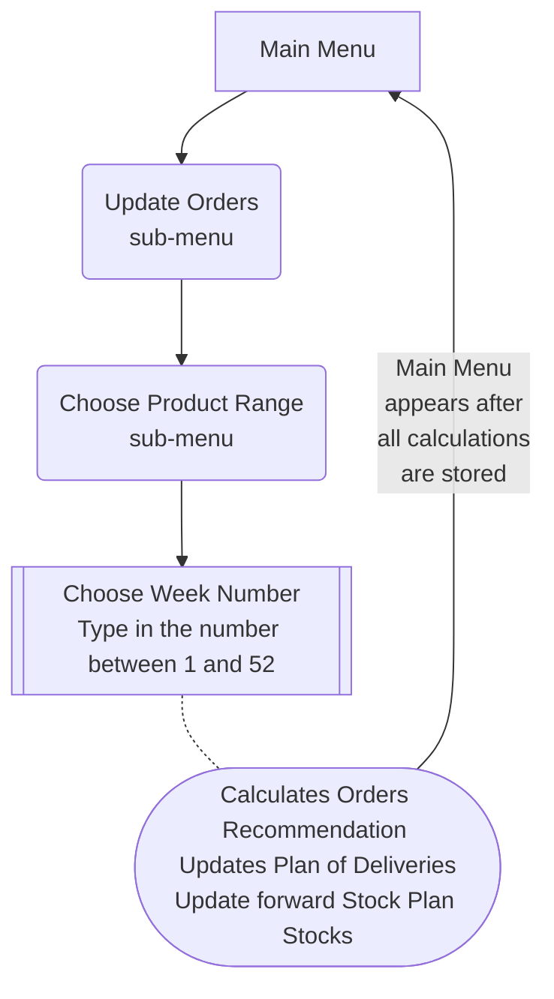
### Future features
The application requires more time to develop and enhance features.
- Allow user to change Safety Margin and Minimum Stock level Constants via terminal window.

Currently it may be done relatively easy by a software programmer making changes to dedicated file 'constants.py'

- Allow user to update sales forecasts manually for all desired weeks for a particular item apart from automated sales forecast calculation

Currently it can be done manually by typing in sales for one column/week at a time. User must be given option for multiple input by row, i.e. by product item for multiple weeks in one go

- Allow user to input actual stocks on a weekly basis to account for discrepancies between planned and actual deliveries and shortages/surplus 

- Provide for smooth transition from year to year, set a procedure to submit past year and open next year

Currently the application deals with the beginning and the end of the year mostly with purpose to prevent from bugs or the program crushing. For example, in the beginning of the year retrospective sales are taken only from the week 1, whereas the automated forecasts, either sales or orders with deliveries are ended by week 52. The weeks closer than the lead time+1 before and after the year end are handled specially.  

## Data Model

The Data Model for the Forward Stock Plan Automation project is designed to efficiently manage and automate stock levels control by interacting with Google Sheets and processing data through a Python-based logic module. The rationale behind this model is to leverage the accessibility and simplicity of Google Sheets while utilizing Python for its powerful data manipulation capabilities.

__Major Blocks__

- Google Sheets:

  - Serves as a cost-effective, cloud-based storage system for data in tabular format.
  - Acts as a pseudo-database, accessible and editable by users.

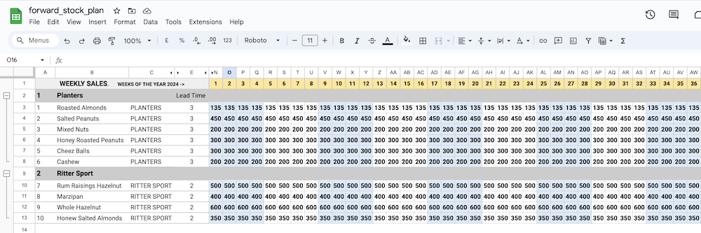
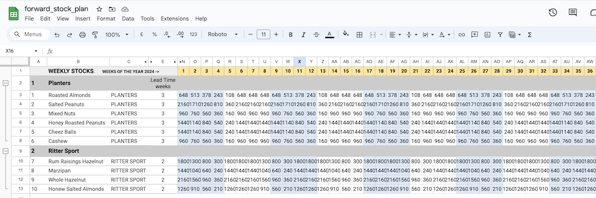
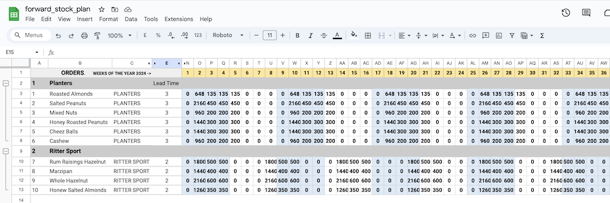
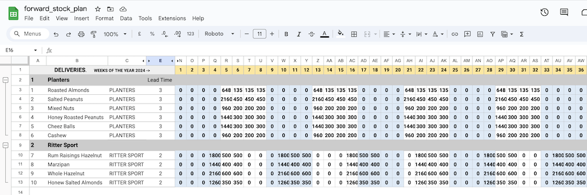

- Project Logic Module:
  - Contains functions that perform calculations and data processing according to business requirements.
  - Ensures that the business logic is encapsulated within the project, separate from data storage.

__Intermediary Python Class__

- A Python class named Worksheets acts as an intermediary between the project logic and the Google Sheets. API
- Responsibilities of the Worksheets class include:
    - Retrieving data from Google Sheets (Weekly Sales, Weekly Stocks, Deliveries, Orders).
    - Preparing data for processing by the logic module.
    - Returning processed data for storage back into the Google Sheets.

__Class Instances and Methods__

- Instances of the __Worksheets__ class represent individual worksheets, such as Sales, Stocks, Deliveries and Orders.
- The class can handle worksheets as objects or as lists of lists, which mimic tables with rows and columns in Python.
- Methods within the class include:
  - Defining columns for specific weeks.
  - Slicing data from past weeks.
  - Converting string data to integers for processing.

__Auxiliary and Utility Functions__

- Additional functions support the Worksheets class and facilitate interaction with the Google Sheets API.
- Examples include:
  - Converting cell notation (R1C1 to A1B1).
  - Updating and writing values to a range of cells in Google Sheets.
- Other functions, which might be considered as utilities include:
  - print data into terminal using _tabulate_ module
  - clear terminal screen
  - some other minor utilities 

__Minimization of API Calls__
- The data model is optimized to minimize the number of Google Sheets API calls
- The .get_all_values() method is used to retrieve all necessary data in a single call.
- All manipulations and calculations are performed within the Python environment, without additional API calls.
- Processed data is then stored back to the worksheet in one action, reducing the load on the API and improving performance.

__Rationale__

The main purpose of the Data Model is to retrieve, process, and store back data related to sales, stocks, deliveries, and orders. The chosen model is structured to:
- __Maximize Efficiency__: By minimizing API calls, the model reduces latency and potential rate limits associated with frequent data retrieval and updates
- __Enhance Organization__: The separation of data storage (Google Sheets) and processing logic (Python module) ensures a clean architecture and easier maintenance.
- __Improve Scalability__: The use of Python allows for complex data processing that can be scaled as business requirements grow.
- __Ensure Accessibility__: Google Sheets provides a user-friendly interface for non-technical users to view and input data, while the backend processing remains robust and automated.

## Testing
### PEP8 Linter

- run.py

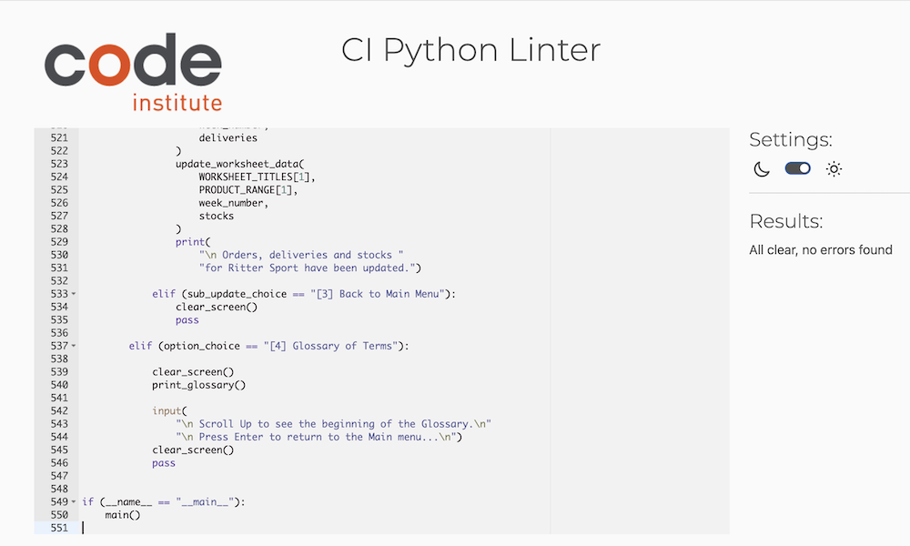

- service.py

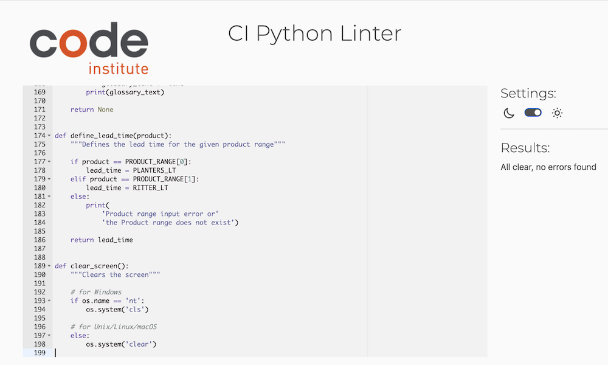

- menus.py

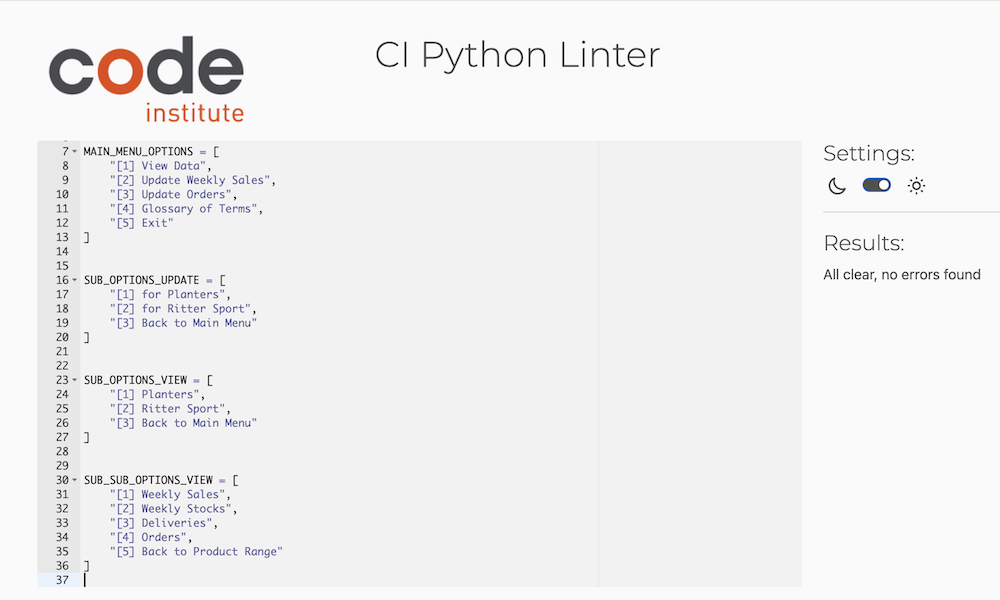

- constants.py

WARNING! I confirm that all my .py files contain last empty line, which might not be rendered or observed on GitHub

