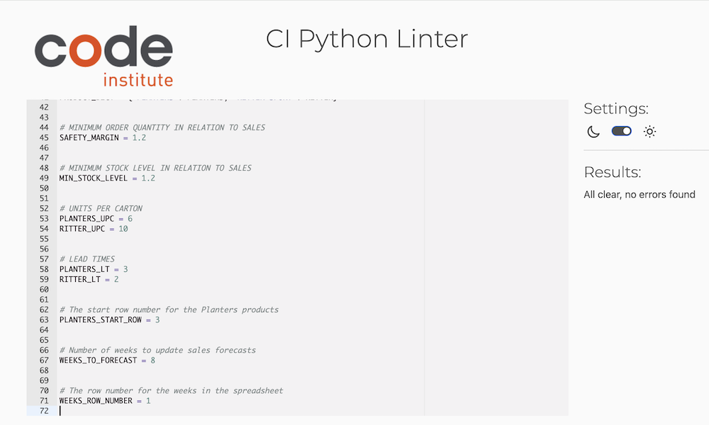
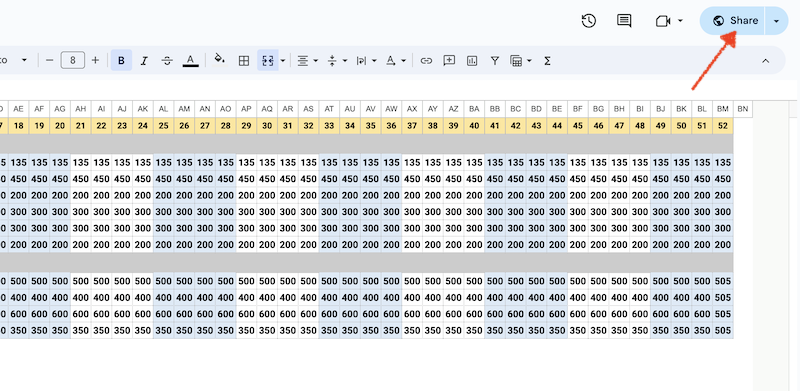

# FORWARD STOCK PLAN AUTOMATION

Forward Stock Plan Automation is a Python terminal program, which is designed to aid to logistic and supply function of distribution and wholesaling companies in order to manage their stock levels and place timely orders. This business process is an everyday job if a distributor strives to avoid out-of-stock situations. An automation of the process becomes a must-have tool for importers, distributors and wholesalers.

The project can be observed and tested [here](https://forward-stock-plan-73f29ce621b0.herokuapp.com/)


## Business Context
Once there is always a non-zero time between placing an order and a delivery of an item the inbound logistics of any business will face a problem of proper stocks control. Such time when the goods are actually in transit is usually called by distributors "__a lead time__". The problem becomes an essential challenge for a business when marketing cycle of that business is comparable to lead times and sometimes may take more then one week, or several weeks or even more than a month (for example, as regards the imports from China)

I developed this application aiming at automation of this process for mid-size and smaller businesses that cannot afford the expensive software and try to cope with the task by means of Excel or other spreadsheet applications.

A Python-based system can offer significant advantages over a purely Excel-based system in terms of data handling, integration with other systems, customization, scalability and data protection. Python can automate mundane tasks, making them much more efficient. This is particularly useful for tasks such as updating sales forecasts, calculating order recommendations, and controlling stock levels. Automation can reduce the risk of human error, increase efficiency, and free up time for more strategic tasks.

Basically, what the application does can be briefly described as follows:

- updates weekly sales forecasts based on actual sales input and retrospective sales
- calculates forward stock plan (future stocks) at the beginning of every coming week to the end of a year and based on weekly  delivery plan
- calculates orders recommendations: quantities per item and time for placement
- updates delivery plan after any change in orders 
- updates forward stock plan based on new order plan and/or sales forecast

At the current version of the application there are 2 product ranges used as templates: 
- Planters nuts with 6 product items
- Ritter Sport chocolate bars with 4 product items

The application assumes easy settings for adding both new product ranges and new product items within a range.

## Glossary Of Terms
    
    "Product Ranges" - product items under one umbrella brand.
    Currently there are two product ranges: Planters and
    Ritter Sport

    "Week Number" - the number of the week in the year
    
    "Weekly Sales" - the number of units sold in the chosen week
    or with regards to future weeks - sales forecast

    "Weekly Stocks" - the number of units in stock at 
    (important!) the beginning of the week

    "Orders" - the number of units to be ordered in 
    a particular week (recommendation) taking into
    consideration the lead time of particular Product Range

    "Deliveries" - the number of units delivered in 
    the past week or with regards to future weeks - 
    to be delivered at the estimated week of delivery

    "Lead Time" - the number of weeks between placing 
    the order and receiving the delivery. The delivered
    goods become available for sale only from the next week
    after estimated arrival (Lead Time + 1)

    "Forward Stock Plan" - the number of units in stock 
    estimated for all future weeks at the current rate of 
    sales and expected deliveries

    "Safety Margin" - the percentage of additional units to 
    order on top of the average sales to avoid stockouts

    "Minimum Stock Level" - the multiple of average sales
    to keep in stock to avoid stockouts

## Features
The application is run in terminal. Once being launched it displays a welcome message and a main menu.

Although the Main Menu consists of 5 options, the first 3 of them, namely View Data, Update Weekly Sales and Update Orders, must be recognized as 3 different Standard Operational Procedures of the program operator (in other words - User) which can be run independently from each other. Each of them can be shortly described as follows:
- View to take decisions or view as a followup of other Procedures
- Update actual sale for the last week or amend sales forecasts
- Launch Order Recommendation (or Update Order) Procedure if needed  

### Navigating menus


- Main menu
    - [1] _View Data_ - view sales, stocks, orders, deliveries
    for a given product range and week number. Data is 
    presented in a table format for all weeks from the
    chosen week number to the end of year

    - [2] _Update Weekly Sales_ - type in sales for the chosen
    product range and week. The data can be updated 
    for any chosen week to record either actual sales or 
    update forecasts. Once all items for the product range 
    have been typed in, the application calculates and updates 
    sales forecast and future stocks. Both Sales and Stocks are then 
    stored in their respective worksheets
    
    __Note:__ As opposed to updating future stocks in Update Orders procedure the future stocks in Update Weekly Sales procedure are calculated at the context of existing orders and deliveries allowing User to observe the effects of amended sales forecasts on forward stock plan situation. 

    It is assumed that following the Update Weekly Sales procedure User can have an option to decide whether to launch the Update Orders procedure or leave it as is.    
    

    - [3] _Update Orders_ - calculate orders recommendation 
    based on new sales, stocks and deliveries data for a 
    given week number and product range. Updates Orders, 
    Deliveries, and Stocks to the respective worksheets

    - [4] _Glossary of Terms_ - basic glossary which provides guidance 
    on using options of the menu and terminology definitions

    - [5] _Exit_ - the correct way to exit the application without hard reset

-  Choose Product Range Sub-Menu:

This sub-menu is common for the 3 main Procedures: [1] _View Data_, [2] _Update Weekly Sales_, [3] _Update Orders_
-   - User is prompted to choose the product range to work with in order to View Data, Update Weekly Sales or Update Orders.


- Main Menu Chart


-------------------
- View Data sub-menu


--------------------------------
- Update Weekly Sales sub-menu


----------------
- Update Orders sub-menu


### Future features
The application requires more time to develop and enhance features.
- Allow user to change Safety Margin and Minimum Stock level Constants via terminal window.

Currently it may be done relatively easy by a software programmer making changes to the dedicated file 'constants.py'

- Allow user to update sales forecasts manually for all desired weeks for a particular item apart from automated sales forecast calculation

Currently it can be done manually by typing in sales for one column/week at a time. User must be given option for multiple input by row, i.e. by product item for multiple weeks in one go

- Allow user to input actual stocks on a weekly basis to account for discrepancies between planned and actual deliveries and shortages/surplus 

- Provide for smooth transition from year to year, set a procedure to submit past year and open next year

Currently the application deals with the beginning and the end of the year mostly with purpose to prevent from bugs or the program crushing. For example, in the beginning of the year retrospective sales are taken only from the week 1, whereas the automated forecasts, either sales or orders with deliveries are ended by week 52. The weeks closer than the lead time+1 before and after the year end are handled specially.  

## Data Model

The Data Model for the Forward Stock Plan Automation project is designed to efficiently manage and automate stock levels control by interacting with Google Sheets and processing data through a Python-based logic module. The rationale behind this model is to leverage the accessibility and simplicity of Google Sheets while utilizing Python for its powerful data manipulation capabilities.

### Major Blocks

- Google Sheets:

  - Serves as a cost-effective, cloud-based storage system for data in tabular format.
  - Acts as a pseudo-database, accessible and editable by users.


- Project Logic Module:
  - Contains functions that perform calculations and data processing according to business requirements.
  - Ensures that the business logic is encapsulated within the project, separate from data storage.

__Intermediary Python Class__

- A Python class named Worksheets acts as an intermediary between the project logic and the Google Sheets. API
- Responsibilities of the Worksheets class include:
    - Retrieving data from Google Sheets (Weekly Sales, Weekly Stocks, Deliveries, Orders).
    - Preparing data for processing by the logic module.
    - Returning processed data for storage back into the Google Sheets.

__Class Instances and Methods__

- Instances of the __Worksheets__ class represent individual worksheets, such as Sales, Stocks, Deliveries and Orders.
- The class can handle worksheets as objects or as lists of lists, which mimic tables with rows and columns in Python.
- Methods within the class include:
  - Defining columns for specific weeks.
  - Slicing data from past weeks.
  - Converting string data to integers for processing.

__Auxiliary and Utility Functions__

- Additional functions support the Worksheets class and facilitate interaction with the Google Sheets API.
- Examples include:
  - Converting cell notation (R1C1 to A1B1).
  - Updating and writing values to a range of cells in Google Sheets.
- Other functions, which might be considered as utilities include:
  - print data into terminal using _tabulate_ module
  - clear terminal screen
  - some other minor utilities 


__Minimization of API Calls__
- The data model is optimized to minimize the number of Google Sheets API calls
- The .get_all_values() method is used to retrieve all necessary data in a single call.
- All manipulations and calculations are performed within the Python environment, without additional API calls.
- Processed data is then stored back to the worksheet in one action, reducing the load on the API and improving performance.


__Rationale__:

The main purpose of the Data Model is to retrieve, process, and store back data related to sales, stocks, deliveries, and orders. The chosen model is structured to:
- __Maximize Efficiency__: By minimizing API calls, the model reduces latency and potential rate limits associated with frequent data retrieval and updates
- __Enhance Organization__: The separation of data storage (Google Sheets) and processing logic (Python module) ensures a clean architecture and easier maintenance.
- __Improve Scalability__: The use of Python allows for complex data processing that can be scaled as business requirements grow.
- __Ensure Accessibility__: Google Sheets provides a user-friendly interface for non-technical users to view and input data, while the backend processing remains robust and automated.

### Flowcharts of the Project's Logic

These flowcharts were worked out before the project for the major procedures and fined tuned in the process.

- Update Weekly Sales  


- Update Orders


## Testing
### Validator Testing. PEP8 Linter

WARNING! I confirm that all my .py files contain last empty line, whereas on GitHub empty lines at the bottom of files are not rendered and cannot be observed.

- run.py


- service.py


- menus.py


- constants.py



WARNING! I confirm that all my .py files contain last empty line, whereas on GitHub empty lines at the bottom of files are not rendered and cannot be observed.

### Manual Testing
I performed the following tests. All passed with expected result.

- [x] Validation of week number. Type in strings, negative numbers, floats 
- [x] Validation of weekly sales input. Type in strings, negative numbers, floats
- [x] Display tabular data. Checked for sales, stocks, deliveries, orders. The data conform with the google spreadsheet
- [x] Display tabular data, time period. Data displayed from exactly the chosen week to the end of year 
- [x] Sales forecast after weekly sales input. Calculation results checked, update of the sales worksheet checked
- [x] Forward stocks plan update after weekly sales input. Calculation results checked, update of the stocks worksheet checked 
- [x] Orders recommendation check. Orders calculated correctly, update of the orders worksheet checked
- [x] Deliveries Plan update. Deliveries conform with orders, update of the deliveries worksheet checked
- [x] Forward stock plan update after orders change. Calculation results checked, update of the stocks worksheet checked
- [x] Big sales spikes check. No negative stocks confirmed. Leads to 0 stocks for a while until an updated order results in respective delivery.
- [x] Beginning of a year check. No issues arise with calculating retrospective sales
- [x] End of year check, sales forecasts. No issues arise related to out of boundary iteration.
- [x] End of year check, orders. Orders continue to be planned even when deliveries are expected to arrive outside the period
- [x] Glossary terminal print out check. Pages are turned by hitting enter, return to the main menu confirmed
- [x] Navigating menus checked. Clear of terminal checked

### Bugs

1. _urllib3 2.0 issue on macOS_

When I tried to get data from my google sheet and print out for the first time my terminal returned the warning 
```
NotOpenSSLWarning: urllib3 v2 only supports OpenSSL 1.1.1+, 
currently the 'ssl' module is compiled with 'LibreSSL 2.8.3'. 
See: https://github.com/urllib3/urllib3/issues/3020
  warnings.warn
``` 
This issue is known to occur with the system Python on macOS, where the SSL module is compiled with LibreSSL instead of OpenSSL. The removal of LibreSSL support in urllib3 version 2.0 means that it cannot be used with the system Python on macOS that is compiled with LibreSSL. 
[urllib3 on GitHub](https://github.com/urllib3/urllib3/issues/3020)

The warning itself does not prevent the code from running, but it indicates that the urllib3 package may not function correctly due to the SSL incompatibility. 

Solution:
  - Install Homebrew
  - Install OpenSSL
  - Install pyenv
  - Configure Zsh for pyenv on macOS [pyenv GitHub](https://github.com/pyenv/pyenv/issues/2136)
  - Set environment variables to point to the correct version of OpenSSL
    [use_homebrew_openssl() function](https://github.com/pyenv/pyenv/blob/master/plugins/python-build/bin/python-build)
  - Install Python with OpenSSL support. In my case it was Python 3.11.7

2. _Validation fixes in Input Weekly Sales_

I discovered during testing that the weekly sales input worked incorrectly. When typing in negative numbers the validation scheme seemed to work fine: `While True` loop with `try` and `else` setting displayed the warning, then the correct prompt to input again the same item appeared. And it did not pass to the next item until the correct type value was keyed in. 

However, when checked in the google sheet after an automated worksheet update, I found that all data including the negative numbers were actually stored to the spreadsheet shifting the cells down. Meaning all the values typed in to the input prompt including the wrong ones were appended to the list `week_sales` despite the correct manifestations on the terminal screen.

After debugging with Python Tutor I found that there was a flaw in my logic:
```
week_sales.append([amount])
    if amount >= 0:
    break
```
The list `week_sales` was formed outside the `if` condition that checked for negative values. The solution was obvious:
```
    if amount >= 0:
    week_sales.append([amount])
    break
```

3. _PEP8 warning E712_
331: E712 comparison to False should be 'if cond is False

I used incorrect operator to compare a variable to Boolean
`while quit_program == False:` 

The correct usage would be 
`while not quit_program:` or `while quit_program is False`.

4. _IndexError: list assignment index out of range_

```
for k in range(from_index, len(sales_row)):
        stocks_row = []
        if stocks_row[k-1] <= sales_row[k - 1]:
            stocks_row[k] = deliveries_row[k - 1]
        else:
            stocks_row[k] = (
                stocks_row[k - 1]
                + deliveries_row[k - 1]
                - sales_row[k - 1]
            )
```
In the above code snippet I tried to assign value to the variable `stock_row[k]` before `stock_row` has been properly initialized with a length that includes the index `k`. The correct one is:
```
stocks_row = [0]*len(sales_row)
for k in range(from_index, len(sales_row)):

        if stocks_row[k-1] <= sales_row[k - 1]:
            stocks_row[k] = deliveries_row[k - 1]
        else:
            stocks_row[k] = (
                stocks_row[k - 1]
                + deliveries_row[k - 1]
                - sales_row[k - 1]
            )
```
Here the `stocks_row` is assigned the length of sales_row before the `for` loop. Whereas `sales_row` was previously defined as `sales_values[i]`, `sales_values` being a list of lists obtained from the google sheet using __gspread__ module and processed by the class Worksheets for further manipulation.  

5. _Negative stocks issue_

- The __beginning stock for the current week__ is defined as:

Beginning Stock of previous week - Sales of previous week + Deliveries of previous week. 

During testing I discovered that the future stocks might appear negative which was wrong. The function that calculates stocks was modified to include the condition: `if stocks_row[k-1] <= sales_row[k - 1]:`

This condition checks if future stocks are less or equal than forecasted sales for that same week. If it is true the stocks must be assigned the value of deliveries for that particular week because business cannot sell what does not exist. Thus, when no deliveries are expected for that particular week, the beginning stock of next week will be equal to 0. 

## Deployment

### To Local Computer 

1. __Set Up the Google Sheet__ 

1.1 Sign in to your Google Account

Make sure you're signed in with your personal Google account.

1.2. Create a Google Sheets file

Navigate to Google Sheets (sheets.google.com) and click on the "+ Blank" button to create a new spreadsheet.

1.3. Navigate to the Google API Library

Go to the Google API Library (console.developers.google.com).

1.4. Create a new project

Click on the dropdown on the navbar to create a new project.

1.5. Enable Google Sheets API

Search for the "Google Sheets API" and enable it. This can take up to 10 seconds.

1.6. Create Credentials

In the "APIs and services" navbar on the left, go to the "Credentials tab". Click on "+ CREATE CREDENTIALS" and select "Service Account".

1.6. Provide Service Account Details

In the first step (service account details), provide a name for the service account, e.g., "supply-operator" and click on "Create and continue".

1.7. Grant Service Account Access

In the second step, grant the service account access to the project. You can select a role from the dropdown menu, such as "Project" > "Editor". Click on "Continue".

1.8. Generate Key

In the third step, click on "+ CREATE KEY" button. Select "JSON" as the key type, and click "Create". This will trigger the download of a JSON file which contains your service account credentials.


1.9. Secure JSON file

Save this file in a safe folder for further use. This file can be downloaded only once!

1.10. Share the Google Sheets file with your Service Account

In order for your service account to access your Google Sheets file, you need to share the file with it. You can do this by going to your Google Sheets file, clicking on the "Share" button in the top right corner above the worksheet, and entering the email address of your service account (you can find this in the JSON file you downloaded earlier).



2. __Create Repositories__

2.1. Register GitHub account if you don't have one

2.2. Go to [My GitHub page](https://github.com/Mykola-CI/forward-stock-plan) 

2.3. Fork the Repository

Click on the "Fork" button at the top right corner of the page. This will create a copy of the repository in your GitHub account.

2.4. Clone the Forked Repository

Navigate to your forked repository on GitHub.
Click on the "Code" button and copy the URL provided under "Clone with HTTPS" or "Clone with SSH" depending on your preference.

2.5. Clone the Repository Locally

Open your terminal or command prompt.
Change the current working directory to the location where you want the cloned directory.
Type git clone, and then paste the URL you copied earlier. For example:

```git clone https://github.com/YOUR-USERNAME/YOUR-REPOSITORY```

Press Enter to create your local clone

2.6. Clone the Repository: 

Clone the forked repository to your local machine using the command 

```git clone https://github.com/yourusername/repository.git```

2.7. Make Changes Locally and stage and Push them to your remote repository as needed. 

2.8 Don't forget to include your creds.json file to .gitignore so as to avoid pushing it to the public resource lik GitHub

3. __Install Python Libraries__

Install the necessary Python libraries using pip or pip3. You will need the google-auth and gspread libraries. You can install them using the following command in your Python environment:

```pip install --upgrade google-auth gspread```

4. __Set up Python Client__

The code template already contains the script required for setting up the client API.
The only thing to do is to create JSON file.

4.1. COPY the JSON key file you saved as per 1.9 of these instructions to your project root directory. 

4.2. IMPORTANT! rename this file exactly `creds.json`

5. __Preparing the Worksheets__

5.1. Product titles and week numbers, worksheets

Currently the project can handle 2 product ranges or two brands and any number of product items within one brand. Adding more brands will require some minor changes to Python code.

 - Worksheets must be named like the ones shown on the pictures below
 - Product items must be keyed in to any column preceding the set of numbers.
 - Product items must be followed by the Brand Name or Product Range title in the same row
 - Between Product ranges or Brands must be exactly 1(one) empty row
 - Week numbers must be positioned in the top first row of the worksheet
 - Week numbers must be integers from at least -4 to 52 including 0. The week 1 is interpreted as the first week of a year and weeks to the left are some last weeks of the previous year (recommended at least 4 weeks of the past year)
 - the structure of the sales worksheet with product items, brands and weeks must be copied to the other worksheets 

 


5.2. Filling in the primary data

- __Sales Worksheet__: numeric data must be positive integers or 0 filled out from week -4 to the end of year week 52.

Note: I advice to fill out all cells for weekly sales both actual and forecasted sales to the year end because the sales data in combination with the beginning stocks are fundament for calculation of a reasonable order recommendation 

- __Stocks Worksheet__: it is recommended to key in at least the actual beginning stock for the starting week, all other cells can be left empty
- __Orders__ and __Deliveries__ numeric data can be left empty for a start 

6. Setting up Constants in Python.

You will need to open constants.py in your IDE or a text editor.

6.1. Assign values to the following constants

- Set Names for your product ranges or brand names (only 2 at this program setting)

For example, 
PRODUCT_RANGE = ["HEINZ", "HELLMANN'S"]

Note: The brand names must be in order consistent to the one in your google sheet from top to bottom

- Set product items within each brand

BRAND1 = [
    "Garlic Sauce",
    "Sweet Chilli Sauce",
    "Ketchup"
]

BRAND2 = [
    "Mayonnaise Light",
    "Mayonnaise"
]

Note: The product names must be in order consistent to the one in your google sheet from top to bottom

- Set Lead Times

BRAND1_LT = 3    

BRAND2_LT = 2
> Meaning 3 weeks for Heinz and 2 weeks for Hellmann's

- Some other ratios to play with

> This is the ratio for order recommendation in relation to weekly sale:

SAFETY_MARGIN = 1.2

> This is generally is a requirement for the minimum stock levels in relation to weekly sale:

MIN_STOCK_LEVEL = 1.2

> The row number of the first product item of Brand1 counting from top of the worksheet:   

BRAND1_START_ROW = 3

> The row number of the week numbers in a year span from top of the worksheet

WEEKS_ROW_NUMBER = 1

### Deployment to Heroku (optional)

I use the Code Institute 'mock terminal' template, all required files needed for the deployment of mock terminal on Heroku are present in the project directory.  

- Setting dependencies

Before launching the application on Heroku you will need to set up dependencies of your project or in other terms references to the packages your project uses to run. Run the following command in terminal:

`pip3 freeze > requirements.txt`

- Create Heroku account if you don't have one

- Login and hit 'create a new app'

- Name your app, choose region and hit 'Create app'

- Once the app has been created got to your app page and there to the 'settings' tab

- from the settings page go to Config Vars by hitting 'Reveal Config Vars' button

- Config Var 1: To the KEY field put CREDS, then copy the contents of your creds.json file and paste it to the VALUE field. Click 'Add'.

- Config Var 2: To the KEY field put PORT, and to the VALUE field type in 8000

- Config Var 3: To the KEY field put GSPREAD_SILENCE_WARNINGS, and to the VALUE field type in 1

- On the same settings page underneath Config vars segment find Buildpacks segment and hit 'Add buildpack'

- Select `python` button

- Then hit 'Add buildpack' one more time and select `nodejs`

- Now go to the Deploy tab on the app page, find Deployment method section and select - GitHub

- In Connect to GitHub section click 'Connect to GitHub' button

- Now as the picture in Connect to GitHub section changed typ in your project name on GitHub and click 'Search' button

- Once it finds the project click 'Connect' button

- Finally underneath the Connect to GitHub section choose between Automatic Deploys or Manual deploy

- Now you can hit view and copy the link for further reference

## Technologies used

- Languages:

  - [Python 3.11.7](https://www.python.org/downloads/release/python-3117/): used to anchor the project and direct all application behavior.

  - [JavaScript](https://www.javascript.com/): used to provide the start script needed to run the Code Institute mock terminal in the browser.

  - [HTML](https://developer.mozilla.org/en-US/docs/Web/HTML) used to construct the elements involved in building the mock terminal in the browser.

- Libraries, Modules:

  - [GSPREAD](https://docs.gspread.org/en/latest/) Module used for Data Exchange between the project's Python and the Google Sheets   

  - [os](https://docs.python.org/3/library/os.html) used to clear the terminal when navigating menus.

  - [Simple Terminal Menu](https://pypi.org/project/simple-term-menu/)  used to implement the menus and sub-menus to enhance User experience while working in terminal mode.

  - [Colorama](https://pypi.org/project/colorama/) used to add colors to the terminal outputs.

  - [Tabulate](https://pypi.org/project/tabulate/) used to print tabular data to console or terminal in a presentable form

  - [Statistics](https://docs.python.org/3/library/statistics.html) used for calculating average weekly sales

  - [Math](https://docs.python.org/3/library/math.html) used for rounding floats

- Services and Tools:

  - [VSCode](https://code.visualstudio.com/) was used as the main tool to write and edit code.

  - [Git](https://git-scm.com/) used for the version control of the website.

  - [GitHub](https://github.com/) used to host the code of the website.

  - [GIMP](https://www.gimp.org/) used to make and resize images for the README file.

  - [Mermaid Charts](https://www.mermaidchart.com/) used to create flowchart diagrams in markdown

  - [Heroku](htpps://www.heroku.com) used for the remote deployment

## Credits

- Code Institute for the deployment terminal.

- Code Institute for the tutorial on setting up Google Sheets and API credentials as made known in the Love-Sandwiches walkthrough project.

- The code line to transpose 2D tabular data from rows to columns and vice versa taken from [Note NKMK](https://note.nkmk.me/en/python-list-transpose/). 

- Terminal menu: [Simple Terminal Menu](https://pypi.org/project/simple-term-menu/).

## Acknowledgements

- [Yuliia Konovalova](https://github.com/IuliiaKonovalova) for the mentor's support during the project
- [ArjanCodes](https://www.arjancodes.com/) for his Python tutorials on [youtube](https://www.youtube.com/@ArjanCodes) 


